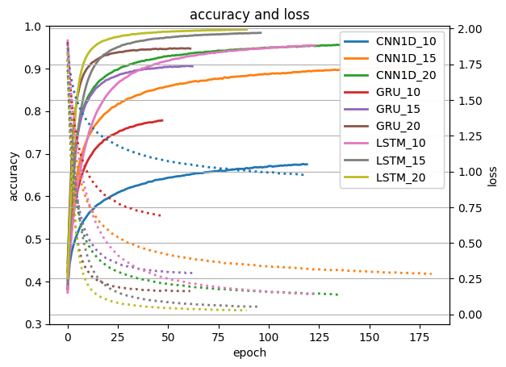
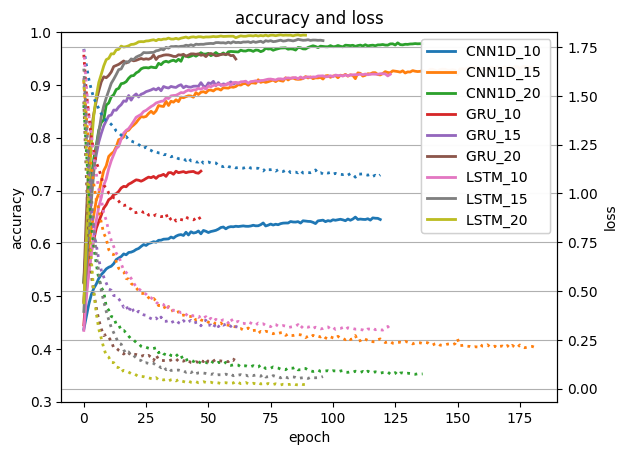

# Animal pose Classification

## Introduction

> 한국정보처리학회 에 투고한 논문의 연구 결과 입니다.
> <br>
> '반려견 영상 실시간 행동 인식 시스템' 논문을 참고하시면 더 자세한 내용을 확인하실 수 있습니다.
> <br> > <br>
> 이 repository 는 논문 이후에 추가로 연구하여 변경된 사항들이 기록되는 곳 입니다
> <br>
> 웨어러블 센서를 이용하지 않고 영상만으로 동물의 행동을 분류합니다.
> <br>
> 이 프로젝트에서는 객체를 탐지하는데 YOLOv8을 사용하였고, 객체의 관절 좌표를 추출하는데 deeplabcut을 사용하였습니다.

> 현재 동시에 두가지 이상 동작(ex> 꼬리 흔들기 + 앞발 들기) 을 분류하는 것은 불가능합니다.
> <br>
> 이는 향후 연구를 통해 개선할 수 있습니다.

## 목차

```
1. 파일 구조
2. 필요한 파일
3. Requirements
4. 사용법
5. 결과
6. collaborators
```

## 파일 구조

```
├── model/
│   ├── {model_name}_{window_size}_{label_count}/
│   │   ├── best_model.h5           // 가장 성능이 좋은 모델
│   │   ├── history.pkl             // 모델의 학습 과정 중 loss, accuracy 등의 정보를 가진 객체
│   │   ├── model_history.png       // 모델의 학습 과정 중 loss, accuracy 등의 정보를 그래프로 나타낸 이미지
│   │   └── model.h5                // keras 모델
│   ├── {deeplabcut model}/         // deeplabcut 모델 디렉토리
│   └── onehot_encoder.pkl          // 행동을 onehot encoding 한 객체
├── videos/experimental_videos/     // 실험 영상
├── angle.py            // 관절 좌표를 이용하여 각도를 계산하는 코드
├── data_sensor.py      // 이미지의 관절 좌표를 추출하는 코드
├── detect.py           // yolo를 이용하여 동물의 위치를 찾는 코드
├── predict.py          // 영상에서 동물의 행동을 분류하는 코드
├── train.py            // 모델 학습하는 코드
├── demo_gradio.py      // gradio를 이용하여 모델을 데모하는 코드
├── demo_predict.py     // 모델을 이용하여 데모하는 코드
└── README.md
```

### 필요한 파일

- <a href="https://pieroot.xyz/file/public/experimental_videos.tar.gz" target="_blank">학습한 영상 파일</a>
- <a href="https://pieroot.xyz/file/public/model.tar.gz" target="_blank">deeplabcut 모델</a>

위 링크를 통해 각 파일을 다운로드
<br>
받아 압축을 풀고 model 디렉토리와 videos 디렉토리를 프로젝트 디렉토리에 위치시킵니다.

- 영상 파일 -> videos/experimental_videos/
- deeplabcut 모델 -> model/

> wget 을 통한 다운로드는 막혀 있습니다

## Requirements

> - python == 3.10
> - ultralytics==8.0.222
> - deeplabcut[tf,gui]==2.3.8
> - torch == 1.12
> - scikit-learn==1.3.2
> - tensorflow == 2.11.1
> - gradio
> - cudatoolkit=11.2
> - cudnn=8.1.0

위 환경에서 테스트 되었고, 다른 환경에서 검증되지 않았습니다.
<br>
아래의 방법으로 환경을 구성하시길 권장합니다.

gpu 사용시 자동 설치를, cpu 사용시 수동 설치를 진행하시길 권장합니다.

## 자동 설치

anaconda 설치

```bash
conda env create -f environment.yml

conda activate animal
```

pip 설치

```bash
pip install -r requirements.txt
```

## 수동 설치

### yolo 설치

yolo 와 deeplabcut 의 의존성 문제로 패키지들이 깨질 위험이 있기 때문에 conda 환경을 추천합니다.

```bash
conda create -n animal python=3.10
conda activate animal
```

yolo 의 경우 의존성 문제가 중요함으로 가장 먼저 설치를 진행합니다.

```python
pip install ultralytics==8.0.222
```

### deeplabcut 설치

```python
pip install "deeplabcut[tf,gui]"==2.3.8
```

### torch 버전 변경

deeplabcut 이 pytorch 버전이 1.12 이하만 지원이 되기 때문에 pytorch 버전을 1.12로 맞춰줍니다.

```python
pip install torch==1.12.0+cu113 torchvision==0.13.0+cu113 torchaudio==0.12.0 --extra-index-url https://download.pytorch.org/whl/cu113
```

### tensorflow 버전 변경

윈도우의 의존성 문제로 deeplabcut이 tensorflow 2.10 버전으로 강제로 내려 설치가 진행됩니다.
<br>
tensorflow 2.11 버전으로 설치를 진행합니다.

```python
pip install tensorflow==2.11.1
```

### gradio 설치

```python
pip install gradio
```

<!-- 중요 -->

## gpu 사용을 위해 반드시 필요!

> gpu 사용을 위해 반드시 필요한 과정입니다.

> conda 환경에 진행해야 다른 환경에 영향을 주지 않습니다.

### gpu 드라이버 설치

gpu 드라이버를 설치해야 gpu 를 사용하여 학습 및 추론이 가능합니다.
<br>
자동 설치시 아래 환경변수만 설정하면 됩니다.

**nvidia 그래픽 카드를 사용하는 경우**

```bash
conda install -c conda-forge cudatoolkit=11.2 cudnn=8.1.0
```

환경변수 설정

```bash
# bash
mkdir -p $CONDA_PREFIX/etc/conda/activate.d
echo 'export LD_LIBRARY_PATH=$LD_LIBRARY_PATH:$CONDA_PREFIX/lib/' > $CONDA_PREFIX/etc/conda/activate.d/env_vars.sh
```

## 사용법

### 분류 모델 학습

```python
python train.py
```

### yolo를 이용하여 동물의 위치를 찾기

```python
python detect.py
```

### deeplabcut을 이용하여 이미지의 관절 좌표를 추출하기

data_sensor.py 에서 ini_DLC 함수를 사용하여 deeplabcut 의 모델을 적용
<br>
get_img_coord 함수를 사용하여 이미지의 관절 좌표를 추출 할 수 있습니다

### 모델을 이용하여 동물을 탐지, 행동을 분류하기

```python
python predict.py
```

### 모델을 이용하여 데모하기

웹을 통해 모델을 데모할 수 있습니다.

```python
python demo_gradio.py
```

## 결과

### 모델 학습 결과

#### accuracy



#### validation accuracy



## collaborators

[@alsdk6720](https://github.com/alsdk6720)

[@everna12](https://github.com/everna12)
